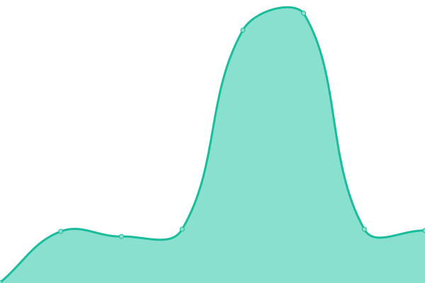
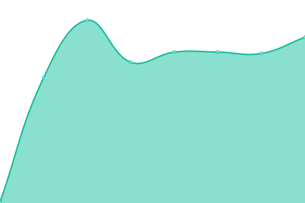
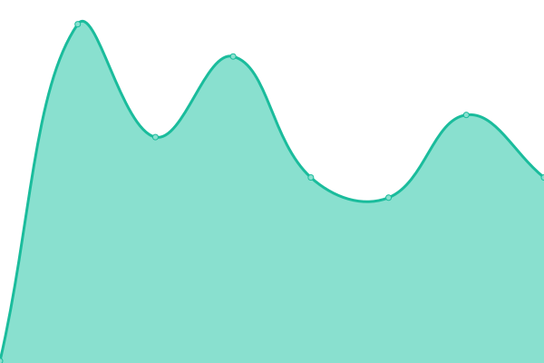
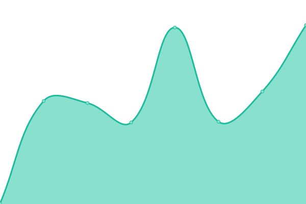
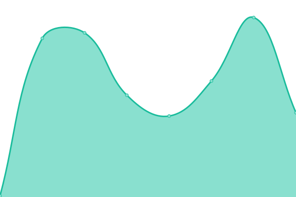

# [📈 Live Status](https://hc.danielslab.dev): <!--live status--> **🟧 Partial outage**

This repository contains the open-source uptime monitor and status page for [Xin (Daniel) Feng](https://danielslab.dev), powered by [Upptime](https://github.com/upptime/upptime).

With [Upptime](https://upptime.js.org), you can get your own unlimited and free uptime monitor and status page, powered entirely by a GitHub repository. We use [Issues](https://github.com/danielxfeng/upptime/issues) as incident reports, [Actions](https://github.com/danielxfeng/upptime/actions) as uptime monitors, and [Pages](https://hc.danielslab.dev) for the status page.

<!--start: status pages-->
<!-- This summary is generated by Upptime (https://github.com/upptime/upptime) -->
<!-- Do not edit this manually, your changes will be overwritten -->
<!-- prettier-ignore -->
| URL | Status | History | Response Time | Uptime |
| --- | ------ | ------- | ------------- | ------ |
|  [Google](https://www.google.com) | 🟩 Up | [google.yml](https://github.com/danielxfeng/upptime/commits/HEAD/history/google.yml) | 

 85ms
     
 | 

<a href="https://hc.danielslab.dev/history/google">0.00%</a>
    

|  [AuthDemo](https://auth-demo-sage.vercel.app/) | 🟩 Up | [auth-demo.yml](https://github.com/danielxfeng/upptime/commits/HEAD/history/auth-demo.yml) | 

 163ms
     
 | 

<a href="https://hc.danielslab.dev/history/auth-demo">100.00%</a>
    

|  [AuthWakeup](https://auth-demo-x0sd.onrender.com/api/ping) | 🟩 Up | [auth-wakeup.yml](https://github.com/danielxfeng/upptime/commits/HEAD/history/auth-wakeup.yml) | 

 273ms
     
 | 

<a href="https://hc.danielslab.dev/history/auth-wakeup">100.00%</a>
    

|  [QuickAgentsFactory](https://agents.danielslab.dev) | 🟥 Down | [quick-agents-factory.yml](https://github.com/danielxfeng/upptime/commits/HEAD/history/quick-agents-factory.yml) | 

 131ms
     
 | 

<a href="https://hc.danielslab.dev/history/quick-agents-factory">0.00%</a>
    

|  [M1Wakeup](https://xin-daniel-feng-mush-worker-2.hf.space/) | 🟩 Up | [m1-wakeup.yml](https://github.com/danielxfeng/upptime/commits/HEAD/history/m1-wakeup.yml) | 

 281ms
     
 | 

<a href="https://hc.danielslab.dev/history/m1-wakeup">100.00%</a>
    

|  [M2Wakeup](https://xin-daniel-feng-mush-worker-1.hf.space/) | 🟥 Down | [m2-wakeup.yml](https://github.com/danielxfeng/upptime/commits/HEAD/history/m2-wakeup.yml) | 

 263ms
     
 | 

<a href="https://hc.danielslab.dev/history/m2-wakeup">100.00%</a>
    

|  [QuickAgentsFactoryBackend](https://agents-api.danielslab.dev/api/v1/health) | 🟥 Down | [quick-agents-factory-backend.yml](https://github.com/danielxfeng/upptime/commits/HEAD/history/quick-agents-factory-backend.yml) | 

 123ms
     
 | 

<a href="https://hc.danielslab.dev/history/quick-agents-factory-backend">0.00%</a>
    

<!--end: status pages-->

[**Visit our status website →**](https://hc.danielslab.dev)

## 📄 License

- Powered by: [Upptime](https://github.com/upptime/upptime)
- Code: [MIT](./LICENSE) © [Anand Chowdhary](https://anandchowdhary.com), supported by [Pabio](https://pabio.com)
- Data in the `./history` directory: [Open Database License](https://opendatacommons.org/licenses/odbl/1-0/)
